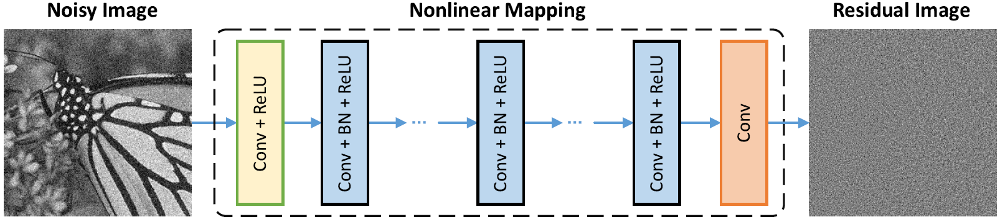
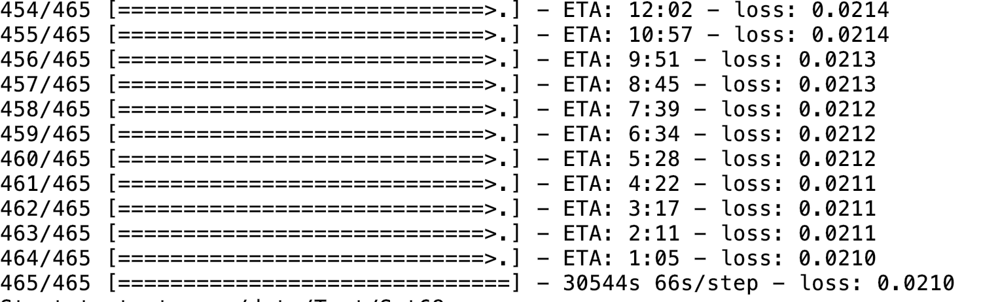

# DnCNN-keras     
A keras implemention of the paper [Beyond a Gaussian Denoiser: Residual Learning of Deep CNN for Image Denoising](http://www4.comp.polyu.edu.hk/~cslzhang/paper/DnCNN.pdf)

### Dependence
```
tensorflow
keras2
numpy
opencv
```

### Prepare train data
```
$ python data.py
```

Clean patches are extracted from 'data/Train400' and saved in 'data/npy_data'.

### Abstract

Discriminative model learning for image denoising has been recently attracting considerable attentions due to its favorable denoising performance. In this paper, we take one step forward by investigating the construction of feed-forward denoising convolutional neural networks (DnCNNs) to embrace the progress in very deep architecture, learning algorithm, and regularization method into image denoising. Specifically, residual learning and batch normalization are utilized to speed up the training process as well as boost the denoising performance. Different from the existing discriminative denoising models which usually train a specific model for additive white Gaussian noise (AWGN) at a certain noise level, our DnCNN model is able to handle Gaussian denoising with unknown noise level (i.e., blind Gaussian denoising). With the residual learning strategy, DnCNN implicitly removes the latent clean image in the hidden layers. This property motivates us to train a single DnCNN model to tackle with several general image denoising tasks such as Gaussian denoising, single image super-resolution and JPEG image deblocking. Our extensive experiments demonstrate that our DnCNN model can not only exhibit high effectiveness in several general image denoising tasks, but also be efficiently implemented by benefiting from GPU computing.

### Train
```
$ python main.py
```

Trained models are saved in 'snapshot'.
### Test
```
$ python main.py --only_test True --pretrain 'path of saved model'
```

Noisy and denoised images are saved in 'snapshot'.

### Network Architecture and Design Rationale




Batch normalization and residual learning are beneficial to Gaussian denoising (especially for a single noise level). The residual of a noisy image corrupted by additive white Gaussian noise (AWGN) follows a constant Gaussian distribution which stablizes batch normalization during training.

Histogram of noisy patches, clean patches, and residual (noise) patches from a batch of training. The noise level is 25, the patch size is 40x40, the batch size is 128.


Histogram of noisy patches, clean patches, and residual (noise) patches from another batch of training. The noise level is 25, the patch size is 40x40, the batch size is 128.


Noise-free image super-resolution does not have this property.
Predicting the residual can be interpreted as performing one gradient descent inference step at starting point (i.e., noisy image).

The parameters in DnCNN are mainly representing the image priors (task-independent), thus it is possible to learn a single model for different tasks, such as image denoising, image super-resolution and JPEG image deblocking.

Please refer to https://github.com/cszn/DnCNN

### Model: modified VGG
1st Layer:
               Conv2D(filters=64, kernel_size=(3,3), strides=(1,1), padding='same')(inpt)
               Activation('relu')(x)
2nd Layer to 15th Layer :
               Conv2D(filters=64, kernel_size=(3,3), strides=(1,1), padding='same')(x)
               BatchNormalization(axis=-1, epsilon=1e-3)(x)
               Activation('relu')(x)
16th Layer:
               Conv2D(filters=1, kernel_size=(3,3), strides=(1,1), padding='same')(x)
               Subtract()([inpt, x])  

Optimization : SGD


#### Results




#### Gaussian Denoising

The average PSNR(dB) results of different methods on the BSD68 dataset.

|  Noise Level | BM3D | DnCNN-S | DnCNN-keras |
|:-------:|:-------:|:-------:|:-------:|
| 25  |  28.57 | 29.23 | 29.21  |
